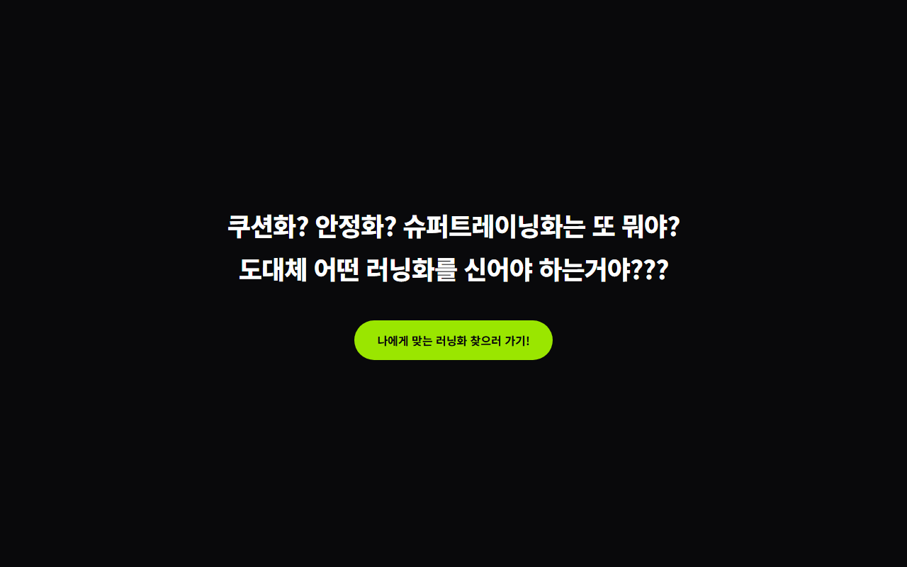
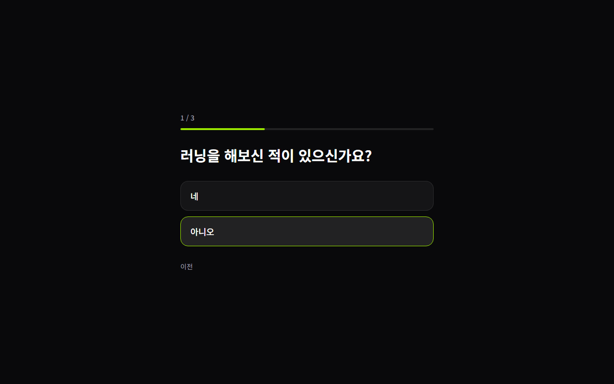
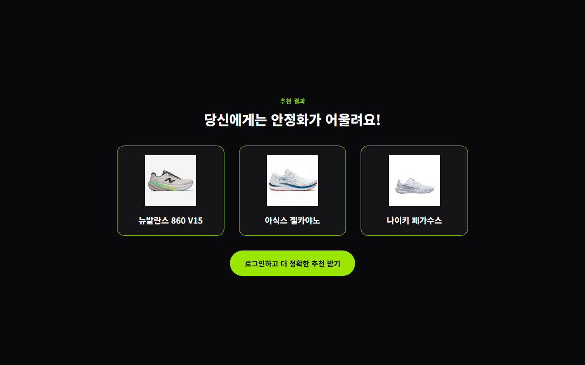
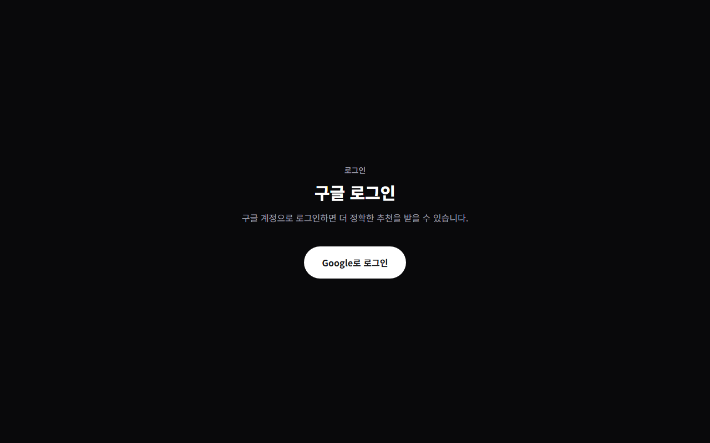
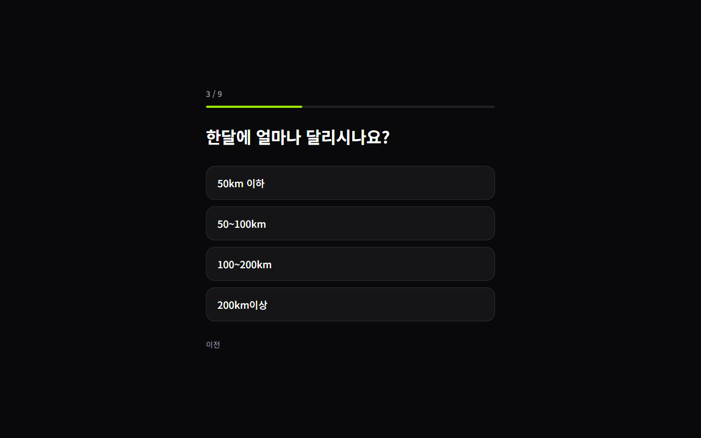
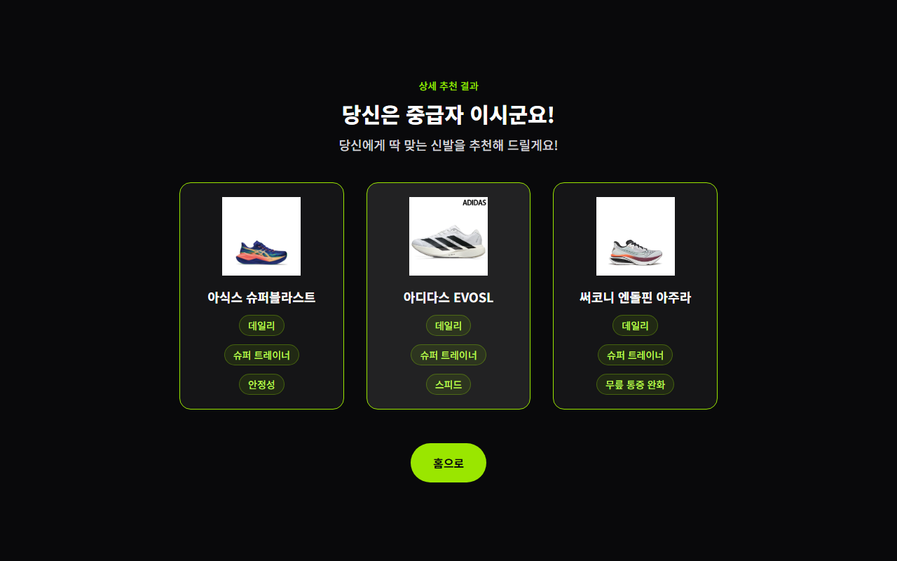
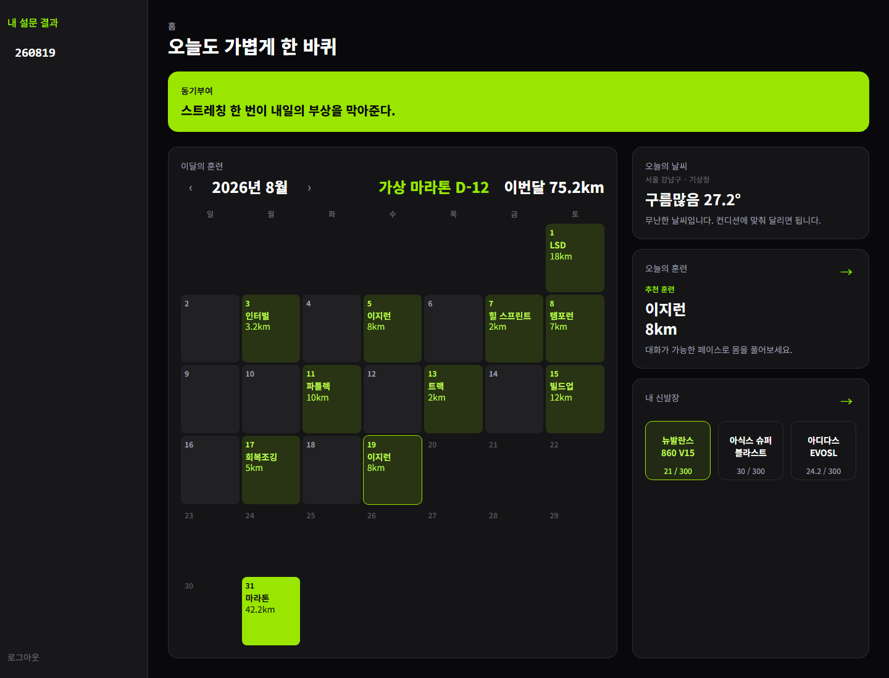

<!-- _class: cover -->
<!-- _paginate: false -->
<!-- _backgroundPosition: 50% 8% -->

부트캠프 수료 발표 · 김주성

<!-- 안녕하세요. 김주성입니다. 오늘은 러닝화 추천 서비스를 짧게 보여드리겠습니다. 초보와 경험자 모두, 신발을 고르는 데 시간이 많이 든다는 점에서 출발했습니다. -->

---

<!-- _class: problem -->

# 문제는 두 가지입니다

초보자는 많은 종류의 신발 앞에서 본인에게 알맞은 신발 보다는 예산, 디자인 등 러닝의 본질보다는 부가적인 기준에 의해 신발을 고르게 됩니다.

경험이 있어도, 본인에게 맞는 신발을 찾기 위해 모든 신발을 경험할 수는 없습니다. 그러다 보니 본인의 실력과 체형에 맞는 신발보다는 인기 브랜드의 인기 라인업을 따라가게 됩니다.

<!-- 초보는 쿠션화, 안정화 같은 말보다 가격과 디자인을 먼저 보게 됩니다. 경험이 있어도 모든 신발을 신어볼 수는 없어서, 결국 잘 팔리는 브랜드와 라인업을 따라가게 됩니다. -->

---

<!-- _class: flow-slide -->

# 설문에서 추천까지

초반 설문

→

초반 결과

→

구글 로그인

심화 설문

→

심화 결과

<!-- 실제 화면입니다. 짧은 설문을 마치면 후보가 나옵니다. 구글로 로그인한 뒤 심화 설문을 하면, 사진과 키워드가 붙은 세 켤레를 보여줍니다. -->

---

<!-- _class: home -->

# 홈 화면

달력, 날씨, 신발장을 한곳에 모았습니다

<!-- 로그인 후 홈입니다. 왼쪽은 이달의 훈련 달력입니다. 오른쪽은 기상청 날씨와 신발장입니다. 오늘 날씨는 실황을 저장해 두고, 비가 오면 뉴발란스 860을 추천합니다. -->

---

# 기술 스택

Next.js · Firebase 구글 로그인

기상청 단기예보 공공데이터

Vercel

<!-- 화면은 Next.js로 만들었고, 로그인은 Firebase 구글 로그인입니다. 날씨는 기상청 단기예보 API를 서버에서 호출합니다. 키는 코드에 넣지 않고 환경변수로 관리합니다. 배포는 Vercel입니다. -->

---

<!-- _class: notes -->

# 소감

기획부터 배포까지 실제로 할 수 있어 좋았습니다

마케팅은 아직 실제로 하지는 못했지만 구현이 완성된다면 우선 나의 러닝 크루에게 먼저 돌려보겠습니다

나의 코딩 실력이 부족해 남들과 협업하는 것을 꺼려했는데 바이브 코딩 부캠이나 협업도 많고, 일반적인 프로젝트나 부캠에서도 AI를 적극적으로 사용하는 분위기이니 적극적인 자세로 참여해야겠다고 느꼈습니다

<!-- 처음부터 끝까지 직접 만들어 배포한 점이 좋았습니다. 마케팅은 아직이지만, 완성되면 먼저 러닝 크루에게 돌려보겠습니다. 실력이 부족해 협업을 피했는데, AI를 쓰는 분위기를 보고 앞으로는 더 적극적으로 참여해야겠다고 느꼈습니다. -->

---

<!-- _class: tracks -->

# 다음 계획

Track 1. 나이키런, 아식스런, 아디다스런 등 기록 앱과 연동

Track 2. 신발 세일 정보를 빠르게 보여 주기

<!-- 다음은 두 트랙입니다. 브랜드 러닝 앱과 연동해 실제 기록이 달력에 들어오게 하고, 신발 세일 정보를 가능한 한 빨리 보여 주고 싶습니다. -->

---

# 감사합니다

https://runningshoes-jus.vercel.app/

<!-- 발표를 마치겠습니다. 서비스 주소는 화면에 있습니다. 감사합니다. -->
